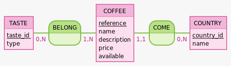

# Merise

## MCD (Modèle Conceptuel de Données)

## MLD (Modèle Logique de Données)

- BELONG ( #reference, #taste_id )
- COFFEE ( reference, name, description, price, available, #country_id )
- COUNTRY ( country_id, name )
- TASTE ( taste_id, type )